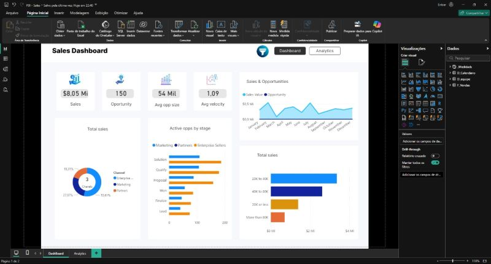
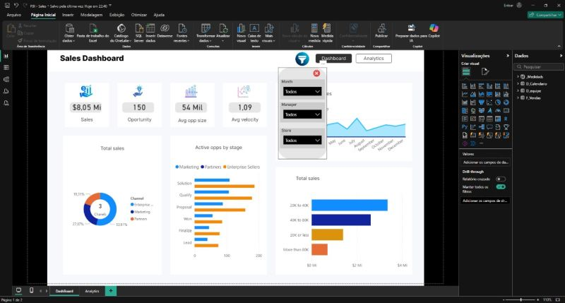
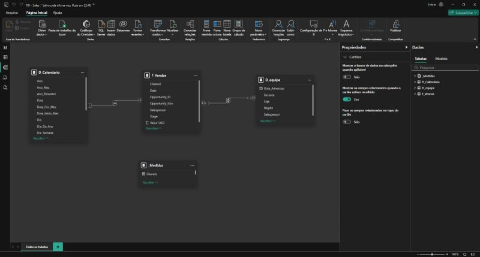
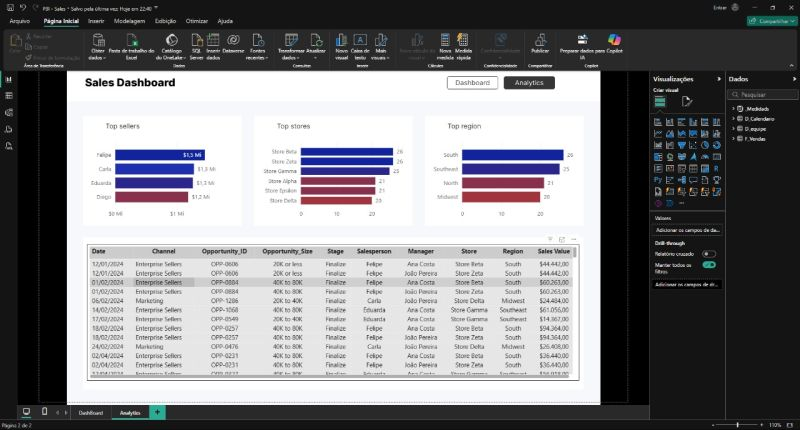

# 📊 Portfólio Power BI — Dashboard de Vendas

Projeto de Business Intelligence desenvolvido no **Power BI Desktop**, com foco em análise de vendas e desempenho de equipe. O objetivo é mostrar a construção completa de um relatório: modelagem de dados, criação de medidas em DAX e visualização interativa.

> ⚠️ Todos os dados utilizados neste projeto são **fictícios**, criados apenas para fins de estudo e portfólio.

---

## 🖼️ Visão geral do dashboard

---

## 🎛️ Filtros e interatividade

O relatório conta com um painel de filtros que permite segmentar a análise, e com páginas de **drill-through** para sair da visão geral e detalhar item a item (por exemplo, por vendedor), mantendo os filtros aplicados.

---

## 🧩 Modelagem de dados

O modelo segue o padrão **Star Schema (esquema estrela)**, com uma tabela fato central ligada às tabelas de dimensão:

| Tabela | Tipo | Descrição |
|---|---|---|
| **Vendas** | Fato | Registros de vendas (valores, quantidades, datas) |
| **Calendário** | Dimensão | Tabela de datas para análises temporais |
| **Equipe** | Dimensão | Dados dos vendedores / equipe comercial |

As métricas do relatório foram criadas com **medidas DAX**, organizadas no modelo para reaproveitamento em todos os visuais.

---

## 📄 Outras visões do relatório

---

## 🛠️ Tecnologias e conceitos

- Power BI Desktop
- Power Query (tratamento e transformação de dados)
- Modelagem dimensional (Star Schema)
- DAX (medidas e cálculos)
- Tabela Calendário para inteligência de tempo
- Filtros, drill-through e interatividade entre visuais

---

## 👤 Autor

**Nathan Filipe Rosa de Souza**
Analista de Dados | SQL · Python · Power BI · Databricks
